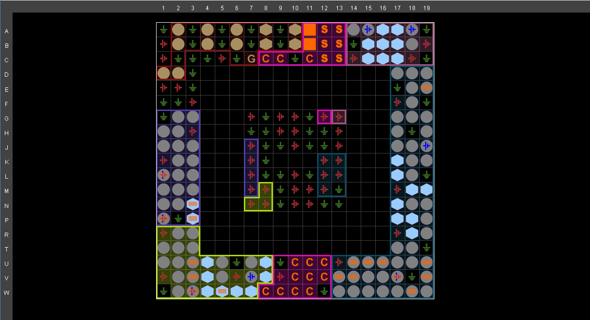
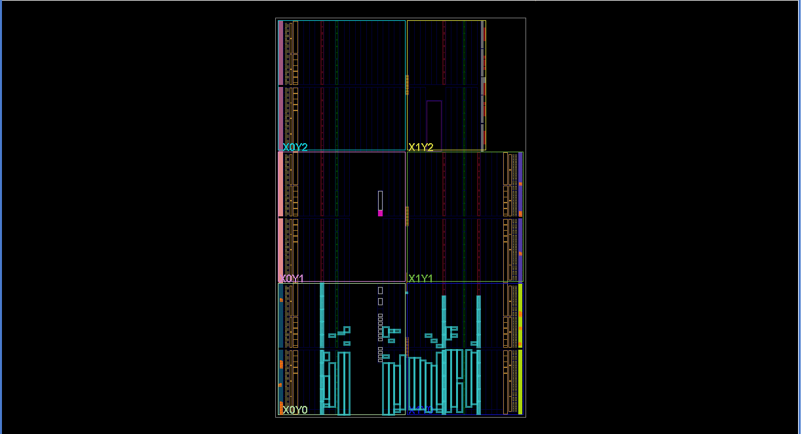
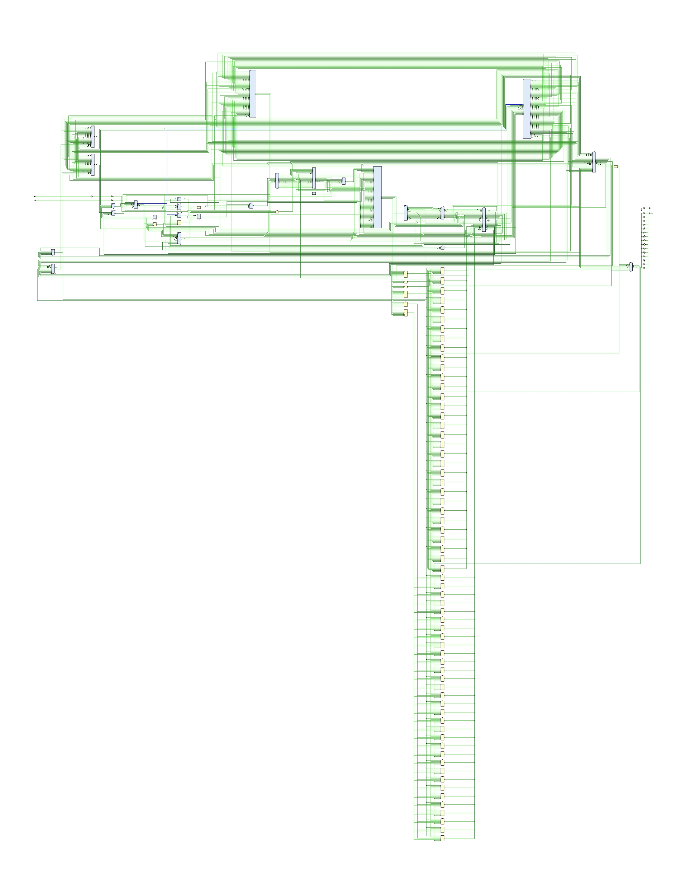

# 5-Stage Pipelined RISC-V Core

## 1. Overview

This project is a complete implementation of a 32-bit RISC-V processor written in Verilog. It features a classic 5-stage pipeline architecture (Fetch, Decode, Execute, Memory, Write-Back) designed to execute a subset of the RISC-V instruction set. The core is capable of running C code compiled using a standard RISC-V GCC toolchain.

 The design prioritizes correctness and clarity, with a full implementation of hazard detection and data forwarding to maximize pipeline efficiency and handle data dependencies correctly.

## 2. Core Features

The processor implements the following architectural features:

*   **ISA Support**: RV32IMC
    *   **I**: Base Integer Instruction Set
    *   **M**: Hardware Multiplier and Divider Extension
    *   **C**: Compressed Instruction Set Extension for reduced code size

*   **5-Stage Classic Pipeline**:
    1.  **IF**: Instruction Fetch
    2.  **ID**: Instruction Decode & Register Fetch
    3.  **EX**: Execute / Address Calculation
    4.  **MEM**: Memory Access
    5.  **WB**: Write-Back

*   **Advanced Hazard Handling**:
    *   **Full Data Forwarding**: Resolves Read-After-Write (RAW) data hazards by forwarding results from the EX and MEM stages directly to the ALU, minimizing stalls.
    *   **Load-Use Hazard Detection**: A dedicated hazard detection unit stalls the pipeline for one cycle when an instruction depends on the result of an immediately preceding `lw` instruction.

*   **Optimized Control Hazard Handling**:
    *   Branch decisions are resolved early in the **Decode (ID) stage** rather than the Execute stage.
    *   This reduces the penalty for a taken branch to a **single-cycle flush**, improving performance.

*   **Compressed Instruction Support**: Includes a decompressor module to fully support the 'C' extension, reducing code size by 25-30%.

## 3. Architecture

The processor follows a standard 5-stage pipeline design. Key components include the Control Unit, Register File, ALU, pipeline registers, and hazard management units.

## 4. Toolchain & Simulation

This project uses a combination of a RISC-V GCC toolchain to generate machine code from C and Icarus Verilog to simulate the processor's execution.

### Prerequisites

*   **RISC-V GCC Toolchain**: `riscv64-unknown-elf-gcc` and associated tools (`objdump`).
*   **Verilog Simulator**: `iverilog` (Icarus Verilog) and `vvp`.
*   **Build Tool**: `make`.

## 5. How to Use

The entire build and simulation process is automated using the provided Makefile.

### Step 1: Write a C Program

Write your desired C code in the `tst.c` file. The program should return its final result from the `main` function, which will then be available in the `a0` (`x10`) register upon completion.

```c
// Example: tst.c
int main() {
    int a = 1;
    int b = 0;
    for (a = 1; a <= 4; a++) {
        b = b + a;
    }
    return b; // Final result will be 10
}
```

### Step 2: Build the Machine Code

Run the make command to compile your C code (tst.c) into a hexadecimal machine code file (instr\_mem.hex) that the processor can read.

```bash
make
```

This command will:

*   Compile `tst.c` and `crt0.S` into object files.
    
*   Link them using `link.ld` to create a final `tst.elf` executable.
    
*   Disassemble the executable into `disasm.txt` for inspection.
    
*   Extract the pure machine code into `instr_mem.hex`.
    

### Step 3: Run the Simulation

Use the run target in the Makefile to simulate the processor executing your code.

```bash
make run
```

This command will:

*   Ensure `instr_mem.hex` is up to date.
    
*   Compile all `.v` files using iverilog.
    
*   Execute the simulation using `vvp`, which will display the state of the registers at each clock cycle.
    

### Step 4: Clean Up

To remove all generated files (object files, executables, hex files, and simulation outputs), use the clean target. Also, in case if running `make` gives an error like `nothing to make`, run the following command: -

```bash
make clean
```

6. Project Structure
-----------------------

```text

📦 Project Files:
├── Top_Module.v              # The top-level module that connects all processor components
├── Control_Unit.v            # Decodes instructions and generates control signals
├── ALU.v                     # Performs arithmetic and logical operations
├── Register.v                # The 32-entry RISC-V register file
├── Forwarding_Block.v        # Implements data forwarding logic
├── Hazard_Detection.v        # Stalls the pipeline for load-use hazards
├── *.v                       # Other Verilog modules for various components (memory, muxes, etc.)
├── tst.c                     # The C source code to be compiled and run on the processor
├── crt0.S                    # Bare-metal startup code
├── link.ld                   # Linker script defining the memory map
├── Makefile                  # Automates the build and simulation process
└── Testbench.v               # The Verilog testbench for simulating the processor   `
```

## FPGA implementation images:
**Image 1: -**



**Image 2: -**



**The Design: -**



**👨‍💻 Author:** Ansh Srivastav
