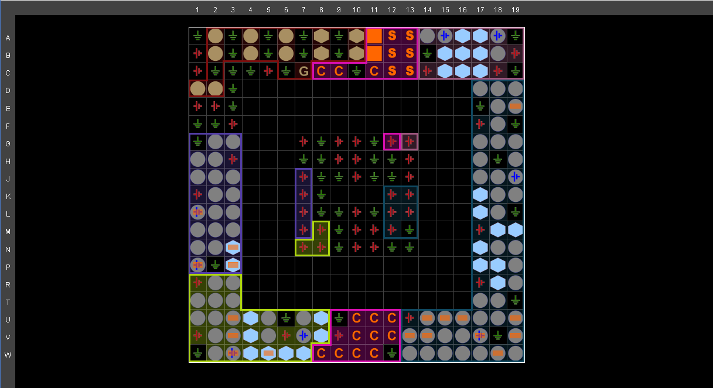
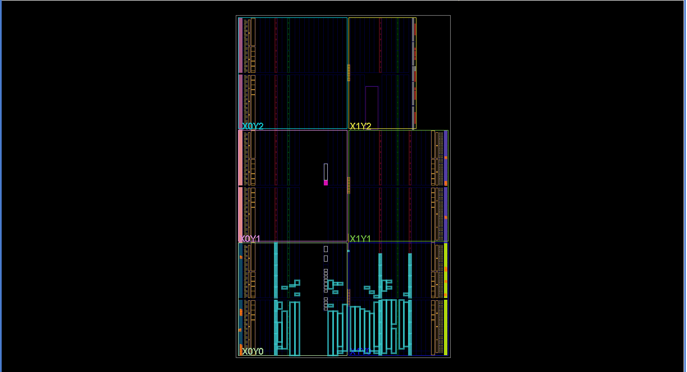
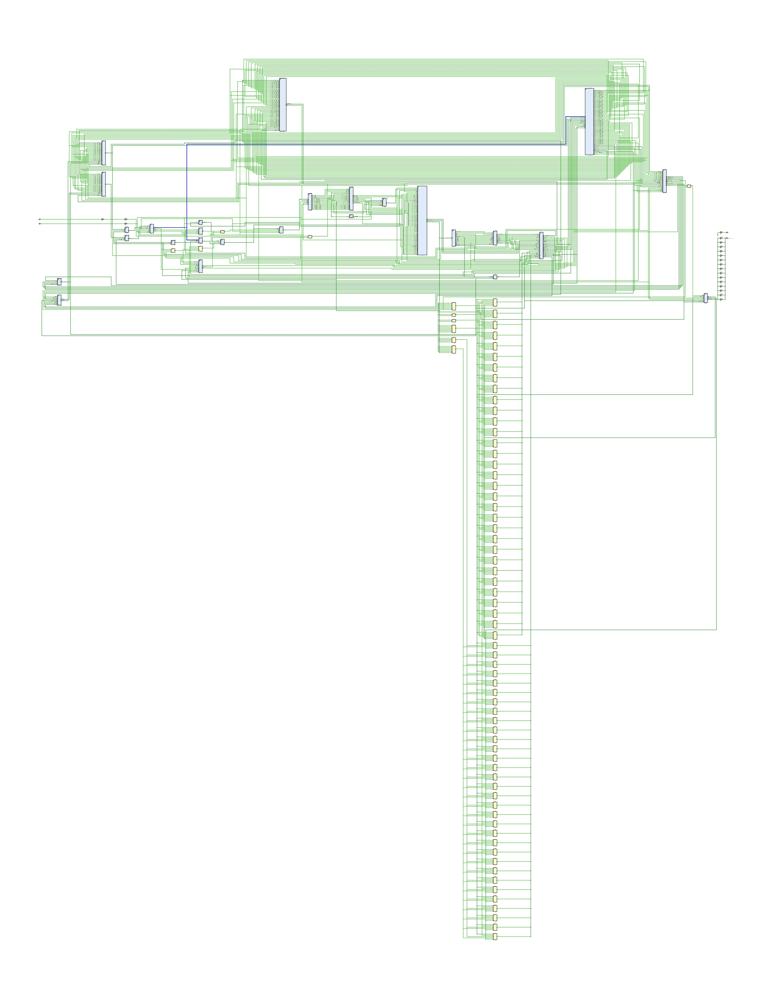

# 5-Stage Pipelined RISC-V Core

## 1. Overview

This project is a complete implementation of a 32-bit RISC-V processor written in Verilog. It features a classic 5-stage pipeline architecture (Fetch, Decode, Execute, Memory, Write-Back) designed to execute a subset of the RISC-V instruction set. The core is capable of running C code compiled using a standard RISC-V GCC toolchain.

 The design prioritizes correctness and clarity, with a full implementation of hazard detection and data forwarding to maximize pipeline efficiency and handle data dependencies correctly.

## 2. Core Features

The processor implements the following architectural features:

*   **ISA Support**: RV32IMC
    *   **I**: Base Integer Instruction Set
    *   **M**: Hardware Multiplier and Divider Extension
    *   **C**: Compressed Instruction Set Extension for reduced code size

*   **5-Stage Classic Pipeline**:
    1.  **IF**: Instruction Fetch
    2.  **ID**: Instruction Decode & Register Fetch
    3.  **EX**: Execute / Address Calculation
    4.  **MA**: Memory Access
    5.  **WB**: Write-Back

*   **Advanced Hazard Handling**:
    *   **Full Data Forwarding**: Resolves Read-After-Write (RAW) data hazards by forwarding results from the EX and MEM stages directly to the ALU, minimizing stalls.
    *   **Load-Use Hazard Detection**: A dedicated hazard detection unit stalls the pipeline for one cycle when an instruction depends on the result of an immediately preceding `lw` instruction.

*   **Optimized Control Hazard Handling**:
    *   Branch decisions are resolved early in the **Decode (ID) stage** rather than the Execute stage.
    *   This reduces the penalty for a taken branch to a **single-cycle flush**, improving performance.

*   **Compressed Instruction Support**: Includes a decompressor module to fully support the 'C' extension, reducing code size by 25-30%.

*   **Bootloader**: Added support for bootloader, that fetches instructions from the connected system and then loads into the main ram to execute.

## 3. Architecture

The processor follows a standard 5-stage pipeline design. Key components include the Control Unit, Register File, ALU, pipeline registers, a bootloader and hazard management units.

## 4. Toolchain & Simulation

This project uses a combination of a RISC-V GCC toolchain to generate machine code from C and Icarus Verilog to simulate the processor's execution.

### Prerequisites

*   **RISC-V GCC Toolchain**: `riscv64-unknown-elf-gcc` and associated tools (`objdump`).
*   **Verilog Simulator**: `Verilator`.
*   **Automation Tools**: `make`, `bash` and `python`.

## 5. How to Use

The entire build and simulation process is automated using the provided Makefile.

### Step 1: Write a C Program

Write your desired C code in the `tst.c` file. The program should return its final result from the `main` function, which will then be available in the `a0` (`x10`) register upon completion.

```c
// Example: tst.c
int main() {
    int a = 1;
    int b = 0;
    for (a = 1; a <= 4; a++) {
        b = b + a;
    }
    return b; // Final result will be 10
}
```

### Step 2: Build the Machine Code and Run the Simulation

Run the make command to compile your C code (tst.c) into a hexadecimal machine code file (instr\_mem.mem) that the processor can read.

```bash
python automate.py hex
```

Now to run the `hexcode` on to the processor, run the command in the shell as:

```bash
python automate.py run
```

This command will:

*   Compile `tst.c` and `crt0.S` into object files.
    
*   Link them using `link.ld` to create a final `tst.elf` executable.
    
*   Disassemble the executable into `disasm.txt` for inspection.
    
*   Extract the pure machine code into `instr_mem.mem` and data into `data_mem.mem`.

*   Now this extracted data and instructions will run on the processor, giving the output on the console.
        

### Step 4: Clean Up

To remove all generated files (object files, executables, hex files, and simulation outputs), use the clean target. Also, in case if running `make` gives an error like `nothing to make`, run the following command: -

```bash
python automate.py clean
```

## 6. UART and I/O Port

Addresses `0x80000000` and `0x90000000` are assigned for `UART` and `I/O` respectively.

## 7. Project Structure

```text
📦 Project Files:
|
├── automate.py
├── bootloader
│   ├── bootloader.bin
│   ├── bootloader.elf
│   ├── bootloader.s
│   └── boot.sh
├── design
│   ├── EX
│   │   ├── ALU.v
│   │   ├── Forwarding_Block.v
│   │   ├── Hazard_Detection.v
│   │   ├── ID_EX.v
│   │   ├── mult_div_stall.v
│   │   └── PC_ALU_Adder.v
│   ├── ID
│   │   ├── Control_Unit.v
│   │   ├── Ctrl_mux.v
│   │   ├── IF_ID.v
│   │   ├── Imm_Extend.v
│   │   ├── Register.v
│   │   └── RTypeALUControl.v
│   ├── IF
│   │   ├── Decompressor_mux.v
│   │   ├── Decompressor.v
│   │   ├── PCPlus4.v
│   │   └── PC.v
│   ├── MA
│   │   ├── baud_gen.v
│   │   ├── Data_Memory.v
│   │   ├── EX_MEM.v
│   │   ├── FIFO_Rx.v
│   │   ├── FIFO_Tx.v
│   │   ├── FIFO_UART_top.v
│   │   ├── UART_addr_sel.v
│   │   ├── uart_rx.v
│   │   ├── uart_tx.v
│   │   └── UART.v
│   ├── Reset_Sync.v
│   └── WB
│       ├── FourXone_mux.v
│       ├── MEM_WB.v
│       ├── multiplex_3x1.v
│       └── Multiplexer.v
├── memory_files
│   ├── bootloader_rom.mem
│   ├── data_mem.mem
│   └── instr_mem.mem
├── riscv_gcc
│   ├── crt0.o
│   ├── crt0.S
│   ├── disasm.txt
│   ├── link.ld
│   ├── tst
│   ├── tst.c
│   ├── tst.elf
│   └── tst.o
├── sta
│   ├── final_netlist.v
│   ├── run_sta.tcl
│   ├── script.ys
│   └── xilinx_netlist.v
├── top_module
│   ├── Makefile
│   ├── Testbench.v
│   └── Top_Module.v
└── verilator
    ├── bootloader_rom.mem
    ├── data_mem.mem
    ├── instr_mem.mem
    ├── main.cpp
    ├── Makefile
    └── RISCV.vcd
```

## FPGA implementation images:
**Image 1: -**



**Image 2: -**



**The Design: -**



**Author:** `Ansh Srivastav`
